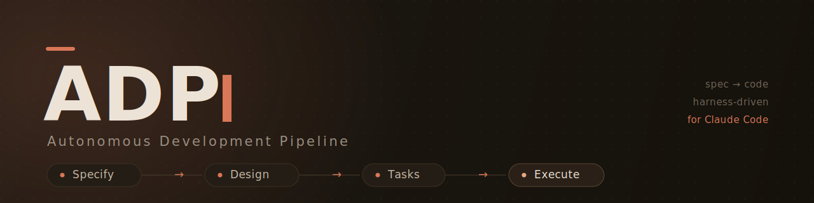
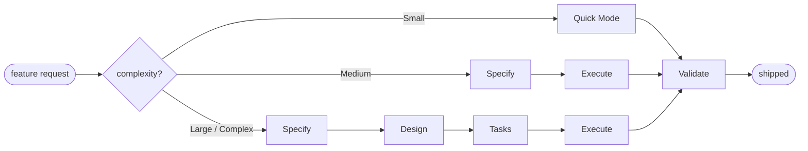
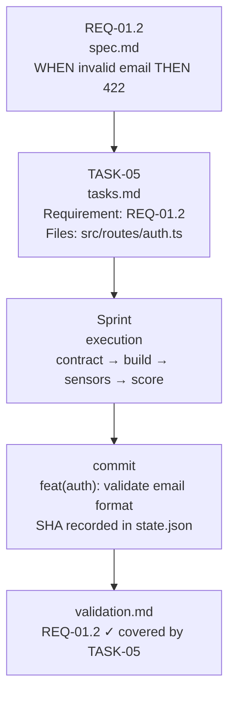
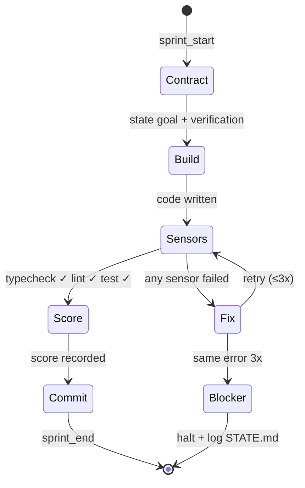

<p align="center">
  
</p>

<h1 align="center">Autonomous Development Pipeline</h1>

<p align="center">
  Harness-driven, spec-to-code execution for Claude Code.
</p>

<p align="center">
  <a href="https://www.npmjs.com/package/adp"></a>
  <a href="https://nodejs.org/">= 22" src="https://img.shields.io/badge/node-%3E%3D22.0.0-339933?style=flat-square&logo=node.js&logoColor=white"></a>
  <a href="https://github.com/0xPuncker/adp/actions/workflows/release.yml"></a>
  <a href="https://github.com/0xPuncker/adp/releases"></a>
  <a href="LICENSE"></a>
</p>

<p align="center">
  <a href="#install">Install</a> ·
  <a href="#quick-start">Quick Start</a> ·
  <a href="#commands">Commands</a> ·
  <a href="#architecture">Architecture</a>
</p>

---

## Overview

ADP is a Claude Code **skill** that turns a spec file into shipped, committed code through four adaptive phases — **Specify → Design → Tasks → Execute** — with feedforward guides (generated from your codebase) and feedback sensors (lint, typecheck, test) enforced at every boundary.

### Two Layers

| Layer | Purpose | Location |
|-------|---------|----------|
| **Skill** | Methodology the agent follows | `SKILL.md` |
| **Runtime** | TypeScript helpers for loading guides, running sensors, persisting state | `src/` |

### Key Capabilities

| Capability | What ADP adds |
|------------|---------------|
| **Spec-to-code pipeline** | Adaptive phases from lightweight quick mode through full Specify → Design → Tasks → Execute. |
| **Feedforward context** | `.adp/guides/` captures stack, architecture, conventions, testing, integrations, and risks before work starts. |
| **Sensor gates** | Typecheck, lint, tests, and configured harness commands run at phase boundaries and before commits. |
| **Traceability** | Requirements, tasks, sprint contracts, commits, and validation artifacts stay linked by stable IDs. |
| **Agent operations** | Pause/resume state, live TUI, evaluator agents, stuck detection, and gated push/PR flow. |

---

## Table of Contents

1. [Quick Start](#quick-start)
2. [Install](#install)
3. [Commands](#commands)
4. [Methodology](#methodology)
5. [Directory Layout](#directory-layout)
6. [Architecture](#architecture)
7. [Templates](#templates)
8. [Development](#development)
9. [References](#references)

---

## Quick Start

Inside any target project:

```
You > adp init
Claude > detects stack, creates .adp/ + .specs/, writes harness.yaml, runs adp map

You > adp run payments
Claude > Specify → clarifying questions → spec.md
        → Design → design.md
        → Tasks → tasks.md (atomic, parallel-marked, REQ-traced)
        → Execute → build → sensors → commit, per task
        → Validate → REQ coverage + UAT
```

State persists between sessions. Stop with `adp pause`, continue with `adp resume`.

---

## Install

### One-line Install

Install once per machine. The installer copies skill files to `~/.claude/skills/adp/` and installs the `adp` CLI globally.

**macOS / Linux / Git Bash / WSL:**
```bash
curl -fsSL https://raw.githubusercontent.com/0xPuncker/adp/main/bin/install.sh | bash
```

**Windows (PowerShell):**
```powershell
iwr -useb https://raw.githubusercontent.com/0xPuncker/adp/main/bin/install.ps1 | iex
```

> If `iex` is blocked by execution policy, run:
> `powershell -ExecutionPolicy Bypass -Command "iwr ... | iex"`

### Install Options

| Option | Purpose |
|--------|---------|
| `ADP_SKILL_ONLY=1` | Install skill files only, skip CLI (no Node required) |
| `ADP_BRANCH=main` | Install specific branch/tag/commit |
| `ADP_FORCE=1` | Overwrite existing install without prompting |
| `ADP_DRY_RUN=1` | Print actions without executing |

**Skill-only mode (no CLI):**
```bash
ADP_SKILL_ONLY=1 curl -fsSL https://raw.githubusercontent.com/0xPuncker/adp/main/bin/install.sh | bash
```

**Standalone binary (no Node required):**
```bash
git clone https://github.com/0xPuncker/adp.git
cd adp && npm install && npm run build:standalone
```

### Update & Uninstall

```bash
adp update                    # Upgrade to latest
adp update --branch feat/foo  # Install specific branch
adp uninstall                # Remove ADP completely
```

### Verify Installation

```bash
ls ~/.claude/skills/adp/SKILL.md && echo "✓ ADP installed"
```

### Requirements

- `git` and `curl` (or PowerShell `iwr` on Windows)
- Node.js ≥ 22 + `npm` (for CLI; skill-only mode skips this)
- Claude Code with skill support

---

## Commands

| Command | Purpose |
|---------|---------|
| `adp init` | Detect stack, create `.adp/` + `.specs/`, write harness.yaml, run `adp map` |
| `adp map` | Analyze codebase, generate feedforward guides |
| `adp feature <request>` | Create feature dir, seed spec.md, start Specify phase |
| `adp run <feature>` | Execute full pipeline: Specify → Design → Tasks → Execute → Validate |
| `adp auto-mode <feature>` | Maximum-autonomy variant with adaptive retry and gated PR |
| `adp status` | Show current sprint, phase, recent activity |
| `adp verify` | Run all sensors; report pass/fail |
| `adp pause` | Snapshot to HANDOFF.md; stop gracefully |
| `adp resume` | Read handoff + state; continue from stopping point |
| `adp tui` | Open live dashboard (sprints, activity, live agents) |
| `adp completions <shell>` | Print shell completion script |

### Live TUI

`adp tui` includes a **Live Agents** panel that tails sub-agent JSONL files in real time:

| Terminal Width | Display |
|----------------|---------|
| ≥120 cols | Three-column dashboard (sprints \| activity \| live) |
| 90–119 cols | Live panel hidden; press `4` or `/live` to focus |
| <90 cols | Live panel hidden entirely |

Each sub-agent is classified, scored against your harness thresholds, and rendered with elapsed time.

### Auto-mode

`adp auto-mode <feature>` is the unattended variant:

- Detects stack and installs matching reference harness
- Overrides `autonomy.clarify=never` and `output=minimal`
- Applies adaptive 3-attempt retry on sensor/evaluator failures
- Gated push/PR at the end (one-click approval)

**Halt conditions:**
1. Sensor fails 3 adaptive attempts on same task
2. Gated action is denied
3. Git conflict cannot be auto-resolved
4. Evaluator scores below `min_score` after fix-up

Auto-mode does not bypass commit-msg hooks, force-push, or merge PRs.

### Shell Completions

```bash
# bash
adp completions bash > /usr/local/etc/bash_completion.d/adp

# zsh
adp completions zsh > "${fpath[1]}/_adp"

# fish
adp completions fish > ~/.config/fish/completions/adp.fish
```

---

## Methodology

### Four Phases



| Scope | Criteria | Phases |
|-------|----------|--------|
| **Small** | ≤3 files, ≤1h, no new deps | Quick Mode only |
| **Medium** | Clear feature, <10 tasks | Specify → Execute → Validate |
| **Large** | Multi-component, 10+ tasks | All phases |
| **Complex** | Ambiguous / new domain | All + gray-area discussion + interactive UAT |

### ID Chain — End-to-End Traceability



**Break the chain = validation failure.**

### The Harness

Two layers protect every task:

- **Feedforward — guides** (`.adp/guides/*.md`) are generated by `adp map` from your codebase. Injected before each phase so the agent sees *this* project's conventions.
- **Feedback — sensors** (`.adp/harness.yaml`) are shell commands (typecheck, lint, test) run after every build. No commit until they pass.

### Sprint Lifecycle



### Action Zones

| Zone | Permissions | Examples |
|------|-------------|----------|
| 🟢 **Free** | Run unprompted | `tsc --noEmit`, `eslint`, `vitest`, local git |
| 🟡 **Gated** | Ask once per session | `docker compose up`, infra commands |
| 🔴 **Always Ask** | Ask every time | Deployments, destructive operations |

---

## Directory Layout

### `.adp/` — Runtime State

```
.adp/
├── state.json        # Pipeline runtime state (machine-readable)
├── harness.yaml      # Sensor commands (typecheck / lint / test)
└── guides/           # Feedforward guides from `adp map`
    ├── stack.md
    ├── architecture.md
    ├── structure.md
    ├── conventions.md
    ├── testing.md
    ├── integrations.md
    └── concerns.md
```

### `.specs/` — Planning Artifacts

```
.specs/
├── HANDOFF.md                     # Pause/resume snapshot
├── project/
│   ├── PROJECT.md                 # Vision, goals, constraints
│   ├── ROADMAP.md                 # Milestones, features, status
│   └── STATE.md                   # Decisions, blockers, deferred ideas
├── features/
│   └── {feature-name}/
│       ├── spec.md                # Requirements (REQ-NN with User Stories)
│       ├── context.md             # Gray-area decisions (if needed)
│       ├── design.md              # Architecture (Large/Complex only)
│       ├── tasks.md               # Atomic tasks (Medium+ only)
│       └── validation.md          # REQ coverage check after Execute
└── quick/
    └── NNN-slug/
        ├── TASK.md                # Quick-mode task
        └── SUMMARY.md             # Quick-mode result
```

---

## Architecture

```
adp/
├── SKILL.md                       # Agent methodology
├── README.md                      # This file
├── templates/
│   ├── SPEC.md                    # Feature spec template
│   ├── harness/                   # Reference harness.yaml per stack
│   ├── hooks/                     # Git hooks (commit-msg enforcer)
│   └── agents/                    # Evaluator / contract-reviewer / worktree
├── completions/                   # Shell completions
├── src/
│   ├── index.ts                   # Public exports
│   ├── types.ts                   # Domain types
│   ├── cli.ts                     # CLI entry
│   ├── ui/                        # Ink/React TUI
│   ├── harness/                   # Sensor execution
│   ├── context/                   # Guide/spec loading
│   └── state/                     # State management
└── tests/                         # Vitest tests
```

### Module Responsibilities

| Module | Purpose |
|--------|---------|
| `harness/` | Executes sensors, captures results |
| `context/loader.ts` | Loads guides + specs for targeted context injection |
| `state/manager.ts` | Owns `.adp/state.json` — sprint lifecycle, activity log |

---

## Templates

`templates/` contains scaffolds for every ADP artifact.

| Template | Copies to | Purpose |
|----------|-----------|---------|
| `PROJECT.md` | `.specs/project/PROJECT.md` | Vision, goals, personas, stack, constraints |
| `ROADMAP.md` | `.specs/project/ROADMAP.md` | Milestones, features, status |
| `STATE.md` | `.specs/project/STATE.md` | Decisions, blockers, deferred ideas |
| `SPEC.md` | `.specs/features/{name}/spec.md` | Feature spec with REQ-NN User Stories |
| `tasks.md` | `.specs/features/{name}/tasks.md` | Atomic tasks with REQ traceability |
| `HANDOFF.md` | `.specs/HANDOFF.md` | Pause/resume snapshot |
| `harness/auto-mode-*.yaml` | `.adp/harness.yaml` | Stack-specific auto-mode harness |

---

## Development

```bash
npm install              # Install dependencies
npm run build           # tsc → dist/
npm run typecheck       # tsc --noEmit
npm run lint            # eslint
npm test                # vitest run
npm run test:watch      # vitest watch mode
```

Single test:
```bash
npx vitest run src/harness/engine.test.ts
npx vitest run -t "passes on exit code 0"
```

---

## References

- **[TLC Spec-Driven](https://agent-skills.techleads.club/skills/tlc-spec-driven/)** — Four-phase methodology (Specify → Design → Tasks → Execute)
- **[Karpathy's Agent Coding Skills](https://github.com/forrestchang/andrej-karpathy-skills)** — LLM coding discipline rules
- **[Conventional Commits 1.0.0](https://www.conventionalcommits.org/)** — Commit message convention
- **[Anthropic — Harness Design for Long-Running Apps](https://www.anthropic.com/research/building-effective-agents)** — Evaluator-as-separate-agent principle
