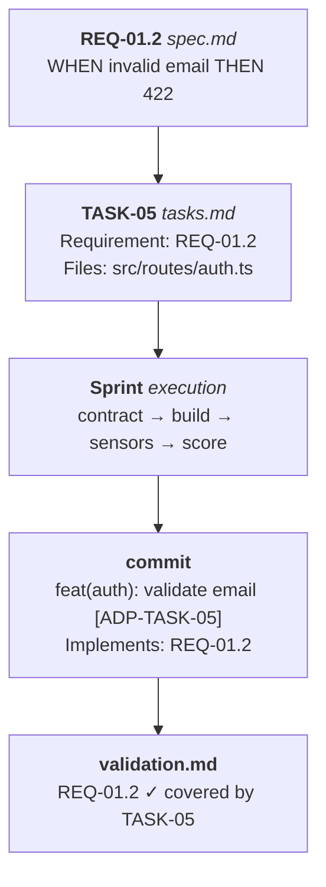
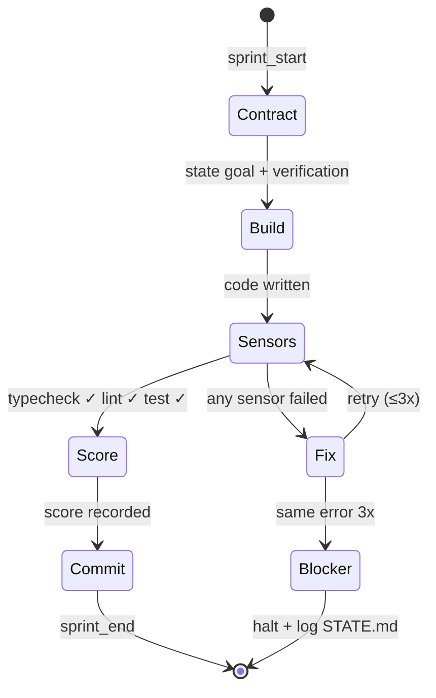
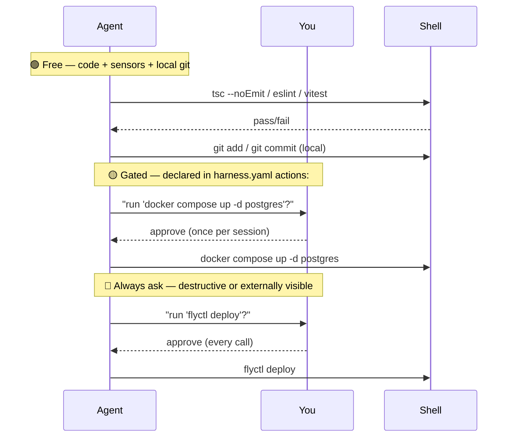

# ADP - Autonomous Development Pipeline

Harness-driven, spec-to-code execution for Claude Code.

ADP is a Claude Code **skill** that turns a spec file into shipped, committed code
through four adaptive phases — **Specify → Design → Tasks → Execute** — with
feedforward guides (generated from your codebase) and feedback sensors (lint,
typecheck, test) enforced at every boundary.

- **Skill layer** (`SKILL.md`) — methodology the agent follows.
- **Runtime layer** (`src/`) — TypeScript helpers for loading guides, running
  sensors, and persisting pipeline state.

> Inspired by TLC Spec-Driven. ADP adds a computational harness (live sensors,
> scoring, stuck detection) on top of the four-phase spec-driven methodology.

---

## Table of Contents

1. [Install](#install)
2. [Quick Start](#quick-start)
3. [Methodology](#methodology)
4. [Directory Layout](#directory-layout)
5. [Commands](#commands)
6. [Architecture](#architecture)
7. [Templates](#templates)
8. [Development](#development)

---

## Install

Install the skill once per machine. After it lands in `~/.claude/skills/adp/`,
Claude Code picks it up automatically in every project.

**macOS / Linux / WSL**

```bash
curl -fsSL https://raw.githubusercontent.com/0xPuncker/adp/main/install.sh | bash
```

**Windows (PowerShell)**

```powershell
iwr -useb https://raw.githubusercontent.com/0xPuncker/adp/main/install.ps1 | iex
```

**Via npx (any platform with Node ≥ 22)**

```bash
npx github:0xPuncker/adp adp-install
```

**Manual clone**

```bash
git clone https://github.com/0xPuncker/adp.git ~/.claude/skills/adp
```

### Verify

```bash
ls ~/.claude/skills/adp/SKILL.md && echo "ok"
```

Then open Claude Code in any project and say `adp init`.

### Overrides

All installers honour these environment variables:

| Variable | Default | Purpose |
|----------|---------|---------|
| `CLAUDE_SKILLS_DIR` | `~/.claude/skills` | Alternate skills root |
| `ADP_REF` | `main` | Branch, tag, or commit to install (shell/ps1 only) |
| `ADP_REPO` | `https://github.com/0xPuncker/adp.git` | Fork to install from |

### Requirements

- `git` on `PATH`
- Claude Code with skill support
- Node.js ≥ 22 *(only if using the npx / manual dev workflows)*

### Developing against a local checkout

```bash
git clone https://github.com/0xPuncker/adp.git
cd adp
npm install
npm run build

# Symlink your local copy into Claude Code's skills dir:
ln -s "$(pwd)" ~/.claude/skills/adp
```

---

## Quick Start

Inside any target project:

```
You > adp init
Claude > detects stack, creates .adp/ + .specs/, writes harness.yaml, runs adp map

You > adp run payments
Claude > Specify → clarifying questions → spec.md
        → Design → design.md
        → Tasks → tasks.md (atomic, parallel-marked, REQ-traced)
        → Execute → build → sensors → commit, per task
        → Validate → REQ coverage + UAT
```

State persists between sessions. Stop with `adp pause`, continue with `adp resume`.

---

## Methodology

### The Four Phases


Phases auto-size to the scope of the work:

| Scope | Criteria | Phases |
|-------|----------|--------|
| **Small** | ≤3 files, ≤1h, no new deps | Quick Mode only |
| **Medium** | Clear feature, <10 tasks | Specify → Execute → Validate |
| **Large** | Multi-component, 10+ tasks | All phases |
| **Complex** | Ambiguous / new domain | All + gray-area discussion + interactive UAT |

### The ID Chain

Every piece of work is traceable end-to-end:



Break the chain = validation failure.

### The Harness

Two layers protect every task:

- **Feedforward — guides** (`.adp/guides/*.md`) are generated by `adp map` from
  your codebase. They are injected into context before each phase so the agent
  sees *this* project's conventions, not a generic model prior.
- **Feedback — sensors** (`.adp/harness.yaml`) are real shell commands
  (typecheck, lint, test) run after every build. No commit until they pass.
  3 failures on the same error ⇒ stuck detection ⇒ halt and ask the user.

### The Sprint Lifecycle

Every task inside Execute flows through the same gated loop:



A failing sensor never auto-merges — the pipeline either retries, escalates,
or halts and asks the user.

### Action Zones

Autonomy is scoped to code, not infrastructure. Every shell command falls
into one of three zones; the zone decides whether the agent may run it
unprompted:



See `SKILL.md → Methodology Rules → Action Zones` for the full policy.

### Core Rules

1. **Never fabricate.** Resolve facts via Knowledge Verification Chain:
   codebase → project docs → Context7 MCP → web → *flag uncertain*.
2. **Scope lock.** Touch only files listed in the current task. Out-of-scope
   findings → `STATE.md → Deferred Ideas`.
3. **Fresh context per task.** Re-read what the next task needs; drop history.
4. **Conventional Commits 1.0.0** + `[ADP-TASK-NN]` trailer.
5. **Don't skip sensors.** Never disable a check to make it pass — fix the code.
6. **Action zones.** Free for code, gated for infra, always-ask for destructive state.

---

## Directory Layout

### `.adp/` — runtime state and guides

```
.adp/
├── state.json        # Pipeline runtime state (machine-readable)
├── harness.yaml      # Sensor commands (typecheck / lint / test)
└── guides/           # 7 feedforward guides, generated by `adp map`
    ├── stack.md
    ├── architecture.md
    ├── structure.md
    ├── conventions.md
    ├── testing.md
    ├── integrations.md
    └── concerns.md
```

### `.specs/` — human-readable planning artifacts

```
.specs/
├── HANDOFF.md                     # created by `adp pause` — resume pointer
├── project/
│   ├── PROJECT.md                 # Vision, goals, constraints
│   ├── ROADMAP.md                 # Milestones, features, status
│   └── STATE.md                   # Decisions, blockers, deferred ideas
├── features/
│   └── {feature-name}/
│       ├── spec.md                # Requirements (REQ-NN with User Stories)
│       ├── context.md             # Gray-area decisions (only if needed)
│       ├── design.md              # Architecture (Large/Complex only)
│       ├── tasks.md               # Atomic tasks (Medium+ only)
│       └── validation.md          # REQ coverage check after Execute
└── quick/
    └── NNN-slug/
        ├── TASK.md                # Quick-mode task
        └── SUMMARY.md             # Quick-mode result
```

---

## Commands

| Command | Purpose |
|---------|---------|
| `adp init` | Detect stack, create `.adp/` + `.specs/`, write `harness.yaml`, run `adp map` |
| `adp map` | Analyze codebase, generate the 7 feedforward guides |
| `adp run <feature>` | Execute full pipeline for a feature |
| `adp status` | Show current sprint, phase, recent activity |
| `adp verify` | Run all sensors; report pass/fail |
| `adp pause` | Snapshot to `HANDOFF.md`; stop gracefully |
| `adp resume` | Read handoff + state; continue from the exact stopping point |

All commands are triggered in natural conversation with Claude Code — the agent
reads `SKILL.md` and executes them using its built-in tools (Read, Write, Edit,
Bash, Glob, Grep). There is no standalone CLI binary required.

The optional runtime library (`src/`) is exported for programmatic use.

---

## Architecture

```
adp/
├── SKILL.md                       # Methodology the agent follows
├── README.md                      # You are here
├── templates/
│   └── SPEC.md                    # Copy into .specs/features/{name}/spec.md
├── src/
│   ├── index.ts                   # Public exports
│   ├── types.ts                   # Domain types (Sprint, Activity, PipelineState…)
│   ├── cli.ts                     # CLI entry (adp sensors / status / guides…)
│   ├── interactive.ts             # Interactive REPL
│   ├── ui/                        # Ink/React status TUI
│   ├── harness/
│   │   ├── engine.ts              # Runs sensor commands, reports pass/fail
│   │   ├── config.ts              # Loads .adp/harness.yaml
│   │   └── engine.test.ts
│   ├── context/
│   │   └── loader.ts              # Loads guides + specs from .adp/ and .specs/
│   └── state/
│       ├── manager.ts             # Reads/writes .adp/state.json
│       └── manager.test.ts
├── package.json
├── tsconfig.json
└── vitest.config.ts
```

### Module responsibilities

- **`harness/`** executes sensors. `engine.ts` spawns the shell commands listed
  in `harness.yaml` in configured `order`, captures stdout/stderr/exit code,
  and returns a structured result the agent can act on.
- **`context/loader.ts`** reads `.adp/guides/` and `.specs/` into an object
  the agent can pass to a sub-agent — enabling targeted context-injection
  instead of loading the whole project.
- **`state/manager.ts`** owns `.adp/state.json` — sprint lifecycle, activity
  log, blockers. All writes go through it for consistency.

### Skill vs. Runtime

| Layer | Tells agent | Executes | File |
|-------|-------------|----------|------|
| **Skill** | *what* to do | agent itself (Read/Write/Bash/…) | `SKILL.md` |
| **Runtime** | *how* to do it reliably | Node process | `src/*.ts` |

The skill is authoritative. The runtime is a convenience.

---

## Templates

`templates/` contains pre-filled scaffolds for every artifact ADP expects.
Copy them when bootstrapping, or let the skill create them for you.

| Template | Copies to | Purpose |
|----------|-----------|---------|
| `PROJECT.md` | `.specs/project/PROJECT.md` | Vision, goals, non-goals, personas, stack, constraints |
| `ROADMAP.md` | `.specs/project/ROADMAP.md` | Now / Next / Later / Done milestones with status legend |
| `STATE.md` | `.specs/project/STATE.md` | Decisions, Blockers, Learnings, Deferred Ideas, Todos |
| `SPEC.md` | `.specs/features/{name}/spec.md` | Feature spec with REQ-NN User Stories + WHEN/THEN criteria |
| `tasks.md` | `.specs/features/{name}/tasks.md` | Atomic tasks with Requirement / Files / Reuses / Parallel / Commit |
| `HANDOFF.md` | `.specs/HANDOFF.md` | Pause/resume snapshot — progress, sensors, next steps |

Bootstrap a new feature manually:

```bash
mkdir -p .specs/features/my-feature
cp adp/templates/SPEC.md  .specs/features/my-feature/spec.md
cp adp/templates/tasks.md .specs/features/my-feature/tasks.md
```

Or the recommended path — let `adp run my-feature` generate them with the spec
filled in from your clarifying answers.

---

## Development

```bash
npm run build          # tsc → dist/
npm run typecheck      # tsc --noEmit
npm run lint           # eslint
npm test               # vitest run
npm run test:watch     # vitest in watch mode
```

Single test:

```bash
npx vitest run src/harness/engine.test.ts
npx vitest run -t "passes on exit code 0"
```
